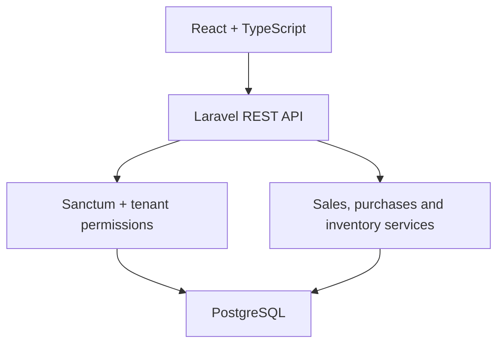

# Casa Repuestos

[](https://github.com/vegaU/casa-repuestos/actions/workflows/ci.yml)

A multi-tenant inventory, purchasing, and sales management platform for automotive parts businesses.

Casa Repuestos is a full-stack portfolio project focused on practical business rules: tenant isolation, branch-level inventory, role-based access control, transactional sales, purchasing workflows, payments, and auditability.

> **Status:** Active development. The core backend, administration, inventory, purchasing, and sales flows are implemented.

## What this project demonstrates

- Design of a multi-tenant business application.
- REST API development with Laravel and Sanctum.
- Tenant isolation and server-side role authorization.
- Transactional checkout with stock validation and rollback.
- Inventory and stock movement tracking by branch.
- React architecture organized by features.
- Automated backend tests and frontend quality checks.
- Reproducible infrastructure with Docker, PostgreSQL, PHP-FPM, and Nginx.

## Core capabilities

- Global administration of companies and company administrators.
- Companies, branches, users, and roles.
- Categories, brands, products, suppliers, and customers.
- Inventory and stock movements per branch.
- Purchases with multi-product receiving and stock updates.
- Sales checkout with discounts, cash received, change calculation, and payment records.
- Sale and purchase cancellation workflows.
- Audit logs for critical operations.
- Protection against cross-tenant data access.

## Architecture



## Technology stack

| Layer | Technologies |
| --- | --- |
| Backend | PHP 8.3, Laravel 12, Laravel Sanctum |
| Frontend | React 19, TypeScript, Vite, Tailwind CSS |
| State and validation | TanStack Query, React Hook Form, Zod |
| Database | PostgreSQL 17 |
| Infrastructure | Docker Compose, PHP-FPM, Nginx |
| Quality | PHPUnit, Oxlint, TypeScript type checking, GitHub Actions |

## Project structure

```text
casa-repuestos/
├── backend/              Laravel REST API
├── frontend/             React application
├── docker/               PHP-FPM and Nginx configuration
├── docs/                 Project documentation
├── .github/workflows/    Continuous integration
└── docker-compose.yml
```

## Run locally

### Requirements

- Docker and Docker Compose
- Node.js 22+
- pnpm

### 1. Start the backend infrastructure

```bash
git clone https://github.com/vegaU/casa-repuestos.git
cd casa-repuestos
cp .env.example .env
cp backend/.env.example backend/.env
docker compose up -d --build
docker compose exec php composer install
docker compose exec php php artisan key:generate
docker compose exec php php artisan migrate --seed
```

The API is exposed through Nginx at [http://localhost:8080](http://localhost:8080).

### 2. Start the frontend

```bash
cd frontend
corepack enable
pnpm install
cp .env.example .env
pnpm dev
```

The frontend runs at [http://localhost:5173](http://localhost:5173) and proxies API requests to the Laravel service.

## Tests and quality checks

```bash
docker compose exec php php artisan test

cd frontend
pnpm lint
pnpm typecheck
pnpm build
```

The GitHub Actions workflow runs the backend tests against PostgreSQL and validates linting, types, and the production frontend build.

## Selected business rules

- Users cannot access data from another company.
- Permissions are enforced by the backend for every tenant-scoped operation.
- Inactive branches cannot receive purchases or sales.
- Checkout rejects insufficient stock and rolls back the complete transaction.
- Completed purchases increase stock; completed sales decrease it.
- Critical operations are recorded for auditing.

See the [permissions matrix](docs/MATRIZ_PERMISOS.md) for the current role model.

## Roadmap

- Expand automated test coverage.
- Add OpenAPI documentation.
- Prepare production deployment and demo data.
- Add invoicing and Paraguay e-Kuatia integration.
- Publish product screenshots and a live demo.

## Author

Developed by [Inocencio Vega](https://github.com/vegaU).
